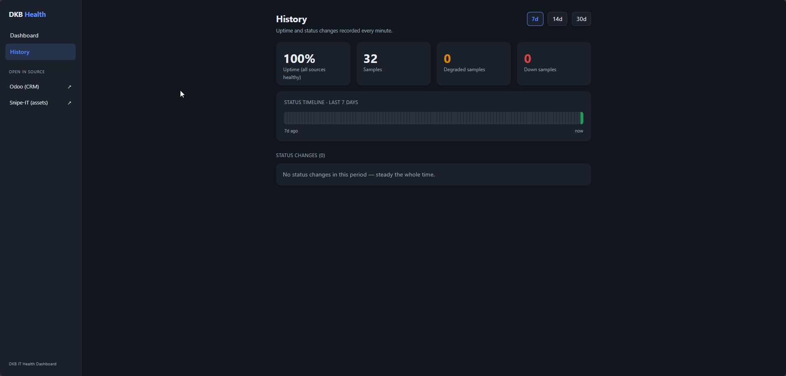

# DKB Multi-Location IT Health Dashboard

A Spring Boot service that aggregates real-time operational health signals across Diamond Kitchen
and Bath's (DKB) internal systems into a single dashboard — one place to check the pulse of assets,
CRM activity, and infrastructure across all company locations.

Each source API is polled on a schedule, normalized into a common health model, cached in memory,
and exposed via REST (with a lightweight built-in web UI).

> Portfolio project modeled on real systems the author integrates with in production, but built as
> an independent, from-scratch service — not a copy of any internal tool.



## Tech stack

| | |
|---|---|
| Language | Java 26 |
| Framework | Spring Boot 4.1 (Spring Framework 7) |
| Web | Spring Web MVC + `RestClient` |
| Persistence | Spring Data JPA + H2 (local dev; swappable for Postgres) |
| Build | Gradle |
| Other | Lombok, Spring Boot Actuator, JSON via Jackson 3 |

## Architecture

```
com.dkb.dashboard
├── config/     → @ConfigurationProperties records + RestClient beans
├── client/     → SnipeItClient (REST), OdooClient (JSON-2) — thin wrappers over external APIs
├── model/      → normalized DTOs (AssetSummary, CrmSummary, HealthSummary) + inbound source DTOs
├── service/    → AggregationService (merges sources), HealthCacheService (in-memory cache)
├── scheduler/  → HealthPollingJob (@Scheduled refresh of the cache)
└── controller/ → HealthController (REST endpoints)
```

**Request flow:** `HealthPollingJob` refreshes the cache on a fixed interval →
`AggregationService` calls each source client and merges results into a `HealthSummary` →
`HealthCacheService` stores the latest snapshot → `HealthController` serves it from cache.

**Resilience:** each source is fetched independently. If one source fails, its section is `null`,
a note is added to `sourceErrors`, and the overall `status` becomes `DEGRADED` (or `DOWN` if all
sources fail) — the endpoint never 500s just because one upstream is unavailable.

## Data sources

1. **Snipe-IT** (asset management) — REST, Bearer token. Pulls total assets, unassigned assets,
   overdue check-ins, and asset counts by status.
2. **Odoo** (CRM) — JSON-2 API (`POST /json/2/<model>/<method>`), API-key Bearer auth. Pulls open
   (not-yet-won) opportunities and recent activity via `crm.lead/search_count`.

## Endpoints

| Method | Path | Description |
|---|---|---|
| `GET` | `/` | React dashboard web UI |
| `GET` | `/api/health/summary` | Aggregated company-wide health snapshot (served from cache) |
| `GET` | `/api/health/history?days=N` | Persisted uptime, status-change events, and a status timeline (days 1–90, default 7) |
| `GET` | `/api/config` | Non-secret config for the UI (source system base URLs) |
| `GET` | `/actuator/health` | Spring Boot Actuator health check |

Example `/api/health/summary` response:

```json
{
  "status": "DEGRADED",
  "generatedAt": "2026-07-20T20:15:03.412Z",
  "assets": {
    "totalAssets": 342,
    "unassignedAssets": 41,
    "overdueCheckouts": 3,
    "assetsByStatus": { "Deployed": 280, "Ready to Deploy": 41, "Archived": 21 },
    "retrievedAt": "2026-07-20T20:15:03.401Z"
  },
  "crm": {
    "openOpportunities": 1430,
    "recentActivityCount": 91,
    "retrievedAt": "2026-07-20T20:15:03.402Z"
  },
  "sourceErrors": []
}
```

Example `/api/health/history?days=1` response:

```json
{
  "days": 1,
  "sampleCount": 24,
  "upCount": 21,
  "degradedCount": 3,
  "downCount": 0,
  "uptimePercent": 87.5,
  "firstSampleAt": "2026-07-19T20:15:00.000Z",
  "lastSampleAt": "2026-07-20T20:15:00.000Z",
  "events": [
    { "at": "2026-07-20T09:02:11.000Z", "from": "UP", "to": "DEGRADED" },
    { "at": "2026-07-20T09:42:55.000Z", "from": "DEGRADED", "to": "UP" }
  ],
  "timeline": [
    { "at": "2026-07-19T20:15:00.000Z", "status": "UP" },
    { "at": "2026-07-20T09:02:11.000Z", "status": "DEGRADED" }
  ]
}
```

**Metric definitions:**
- `unassignedAssets` — assets with no assignee, **excluding archived** (i.e. spare/available gear).
- `overdueCheckouts` — checked-out assets whose expected check-in date has passed.
- `openOpportunities` — active Odoo opportunities that are **not yet won** (`probability < 100`).
- `recentActivityCount` — CRM records created within `dkb.odoo.recent-activity-days` (default 7).

## Configuration

Secrets are **never committed**. `application.properties` references environment variables with
safe local-dev defaults:

| Env var | Property | Notes |
|---|---|---|
| `SNIPEIT_BASE_URL` | `dkb.snipeit.base-url` | Base URL, **no** `/api/v1` suffix |
| `SNIPEIT_API_TOKEN` | `dkb.snipeit.api-token` | Snipe-IT personal API token (Bearer) |
| `ODOO_BASE_URL` | `dkb.odoo.base-url` | Odoo base URL, **no** `/json/2` suffix |
| `ODOO_API_KEY` | `dkb.odoo.api-key` | Sent as `Authorization: Bearer <key>` |

> The Odoo JSON-2 API key is bound to a user + database server-side, so no database name, username,
> or authenticate step is required — the API key alone is enough.

Non-secret tuning (in `application.properties`): `dkb.snipeit.hardware-page-limit`,
`dkb.odoo.recent-activity-days`, `dkb.polling.interval-ms`, `dkb.polling.initial-delay-ms`,
`dkb.history.retention-days` (how long persisted snapshots are kept). The server port
(`SERVER_PORT`, default `8090`) and datasource URL (`JDBC_URL`, default a local file-based H2 DB)
are also overridable via environment variable.

## Running locally

**Prerequisites:** JDK 26 (or let the Gradle toolchain download one automatically) and Node.js
(for the frontend build — see [Frontend](#frontend-react--typescript)). No local install of
Gradle is required; use the bundled `./gradlew`.

```bash
# Set credentials (bash)
export SNIPEIT_BASE_URL=https://assets.example.com
export SNIPEIT_API_TOKEN=xxxxx
export ODOO_BASE_URL=https://odoo.example.com
export ODOO_API_KEY=xxxxx

./gradlew bootRun
```

PowerShell:

```powershell
$env:SNIPEIT_BASE_URL = "https://assets.example.com"
$env:SNIPEIT_API_TOKEN = "xxxxx"
# ...etc
./gradlew bootRun
```

Then open <http://localhost:8090/> for the UI, or:

```bash
curl http://localhost:8090/api/health/summary
curl http://localhost:8090/api/health/history?days=7
```

With no credentials set, the app still starts and returns `status: DOWN` with the source errors
listed — a quick way to confirm the wiring before you have tokens.

### Setting credentials in IntelliJ IDEA

Rather than exporting shell vars, set them on the run configuration:

1. **Run ▸ Edit Configurations…**
2. Select the `DkbHealthDashboardApplication` configuration (or add a new **Spring Boot** one
   pointing at that main class).
3. Find the **Environment variables** field (expand **Modify options ▸ Environment variables** if
   it isn't shown).
4. Click the browse icon (📄) and add each `KEY` / `VALUE` pair, or paste them semicolon-separated:
   `SNIPEIT_BASE_URL=https://…;SNIPEIT_API_TOKEN=…;ODOO_BASE_URL=https://odoo.example.com;ODOO_API_KEY=…`
5. **Apply**, then run. These values live in the IDE run config only — they are not written to the
   repo. (For team sharing without committing secrets, an `.env` file loaded by the
   [EnvFile plugin](https://plugins.jetbrains.com/plugin/7861-envfile) is a common alternative.)

## Frontend (React + TypeScript)

The UI lives in [`frontend/`](frontend) — a Vite + React + TypeScript app that consumes
`/api/health/summary`. It builds into `src/main/resources/static/`, so the whole thing ships as a
**single Spring Boot JAR** (no separate frontend host to deploy).

**Development** (hot reload):
```bash
# terminal 1 — backend on :8090 (via IntelliJ or gradlew bootRun)
# terminal 2 — Vite dev server on :5173, proxying /api to :8090
cd frontend
npm install      # first time only
npm run dev
```
Open <http://localhost:5173>. API calls are proxied to the backend (see `vite.config.ts`), so there
are no CORS issues.

**Production build** (bundle the UI into the backend):
```bash
./gradlew buildFrontend      # runs the Vite build into static/
# or just:
./gradlew bootJar            # bootJar depends on buildFrontend, so the JAR always bundles the latest UI
```
Requires Node.js and a prior `npm install` in `frontend/`. The compiled output in
`src/main/resources/static/` is a build artifact.

## Testing

```bash
./gradlew test
```

- **Client tests** (`SnipeItClientTest`, `OdooClientTest`) use `MockRestServiceServer` to verify DTO
  mapping, normalization, and the JSON-2 `search_count` flow against canned responses — no network required.
- **Service tests** (`AggregationServiceTest`, `HealthCacheServiceTest`) use Mockito to verify
  per-source resilience (UP/DEGRADED/DOWN) and the caching contract.

## Notes on Spring Boot 4 / Jackson 3

This project targets the current Boot 4 line, which has a couple of differences worth knowing:

- **Modular starters:** dependencies like `spring-boot-starter-webmvc` and `spring-boot-h2console`
  replace the older monolithic names.
- **No auto-configured `RestClient.Builder` bean** with the webmvc starter — `RestClientConfig`
  uses the static `RestClient.builder()` factory instead.
- **Jackson 3:** `JsonNode` and databind live under `tools.jackson.databind.*`
  (annotations such as `@JsonProperty` remain under `com.fasterxml.jackson.annotation.*`).

## Roadmap

- [x] Snipe-IT client + `/api/health/summary`
- [x] Odoo client (JSON-RPC)
- [x] Aggregation into a single company-wide health object
- [x] Scheduled polling + in-memory cache
- [x] React + TypeScript frontend (bundled into the JAR)
- [x] Persisted snapshot history + uptime/event view (JPA + H2)
- [ ] Per-location breakdown (map Snipe-IT locations / Odoo teams to locations)
- [ ] Server-room sensor integration (temp/humidity/UPS, SNMP device health)
- [ ] Authentication/authorization
- [ ] Postgres + production deployment target
```
